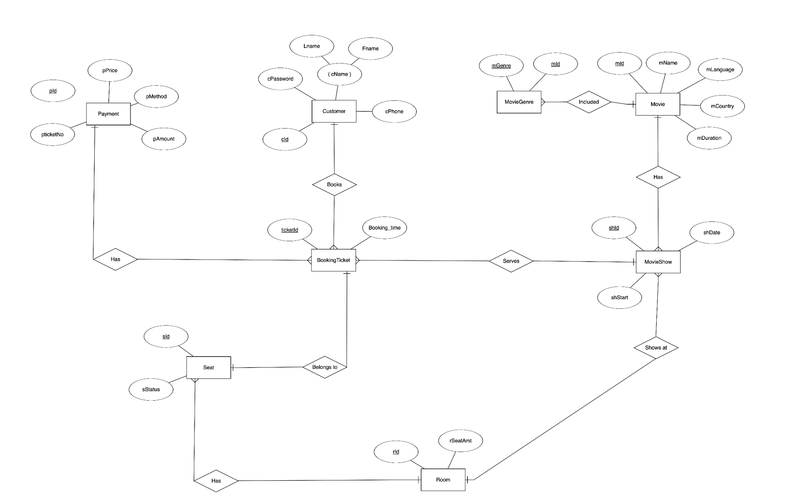
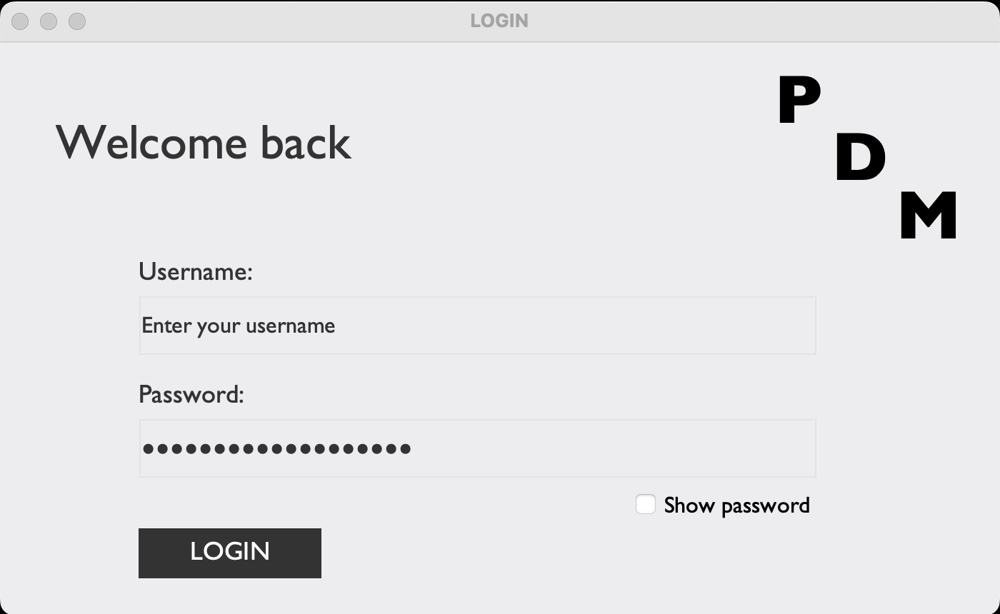
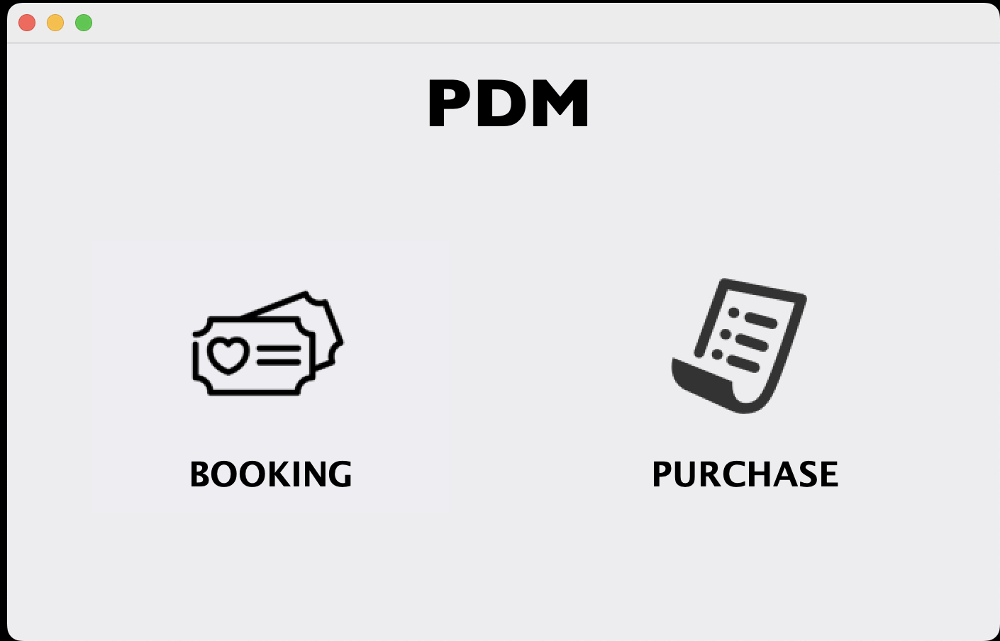
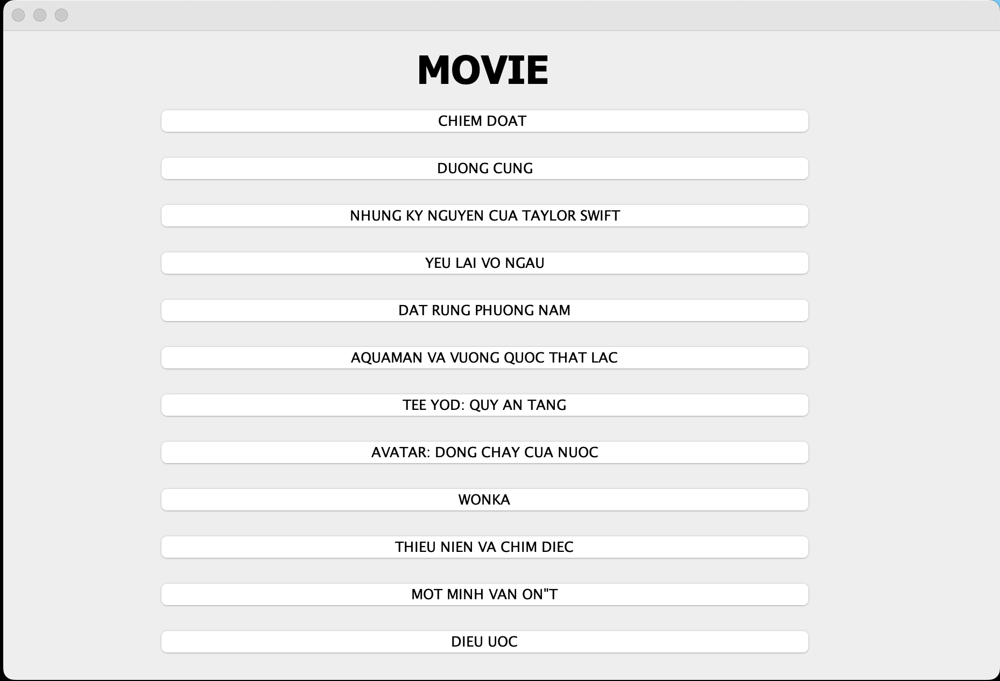
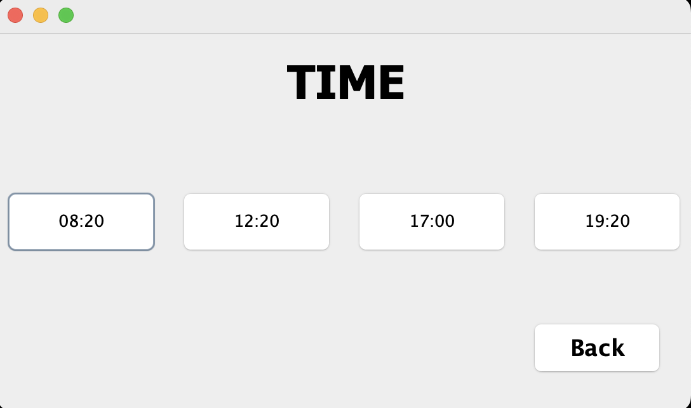
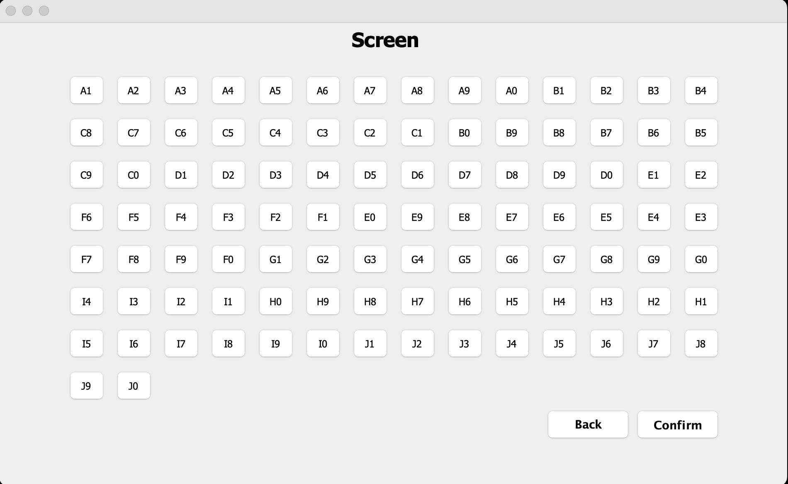
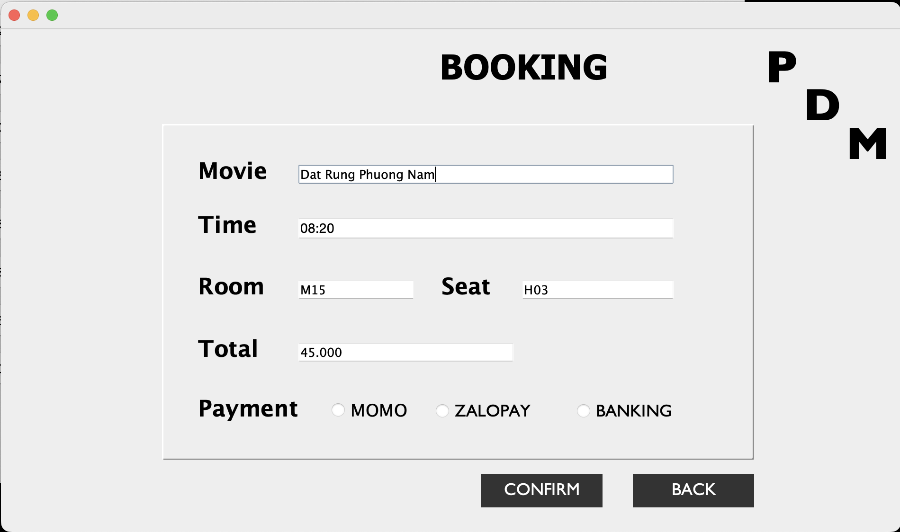
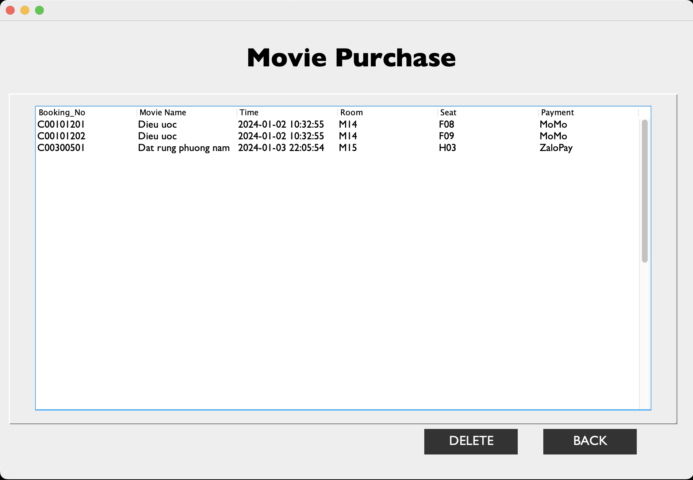

# BOOKING MOVIE TICKET
After creating an account, customers can schedule movie viewings and pay online. After confirming the movie, time, number of seats, amount, and payment method, the information will be saved in the database. Only when the Admin logs in can you cancel movie tickets for any customer.
# Table of contents :

1. [Introduction](#introduction)
2. [Demonstration](#demonstration)
3. [ERD](#erd)
4. [Demo](#demo)
5. [References](#references)

## Introduction  
### Team member
| Index | Name                   |     ID      |
|:------|:-----------:|:-------------------------------|
| 1     | Nguyễn Huỳnh Thảo My | ITCSIU21204 |
| 2    | Lê Thu Hoàng| ITCSIU21063 |
| 3     | Hà Văn Uyển Nhi | ITCSIU21095 | 

### Tasks and Contribution 
| Index | Role                                                         | Person In Charge | Contribution |
|:------|:-------------------------------------------------------------|:--------------:|:------------:|
| 1     | Leader     |   Thảo My   |          33.3%     |
| 2     | Member      |   Thu Hoàng   |         33.3%    |
| 3     | Member  |  Uyển Nhi     |      33.3%        |

| Name | Tasks |
|:------|:-------------------------------------------------------------|
| Thảo My      |  Design database, build purchase interface, connect database sql to java |
| Thu Hoàng | Desgin ERD, login & home interface, connect database sql to java| 
| Uyển Nhi | Design database, Build booking option interface |  

## ERD Diagram  

## Demo   

#### Login Screen  

#### Home Screen 

#### Booking Screen 
- Movie Name

- Time of movie

- Number of seats

- Confirm the information

#### Purchase Screen 
(Only Admin can access this feature)

## References  
[1] YouTube.com: Connect to MySQL Using IntelliJ IDEA 2021 (Community Edition) and Database Navigator Plugin
https://www.youtube.com/watch?v=V2bGKzvMQyc&t=151s

[2] How to use ERD editor enviroment for sql
https://erdplus.com/

[3] Booking System Project Using Java and Mysql
https://www.youtube.com/watch?v=fs_i1eYeEzw&t=1s

